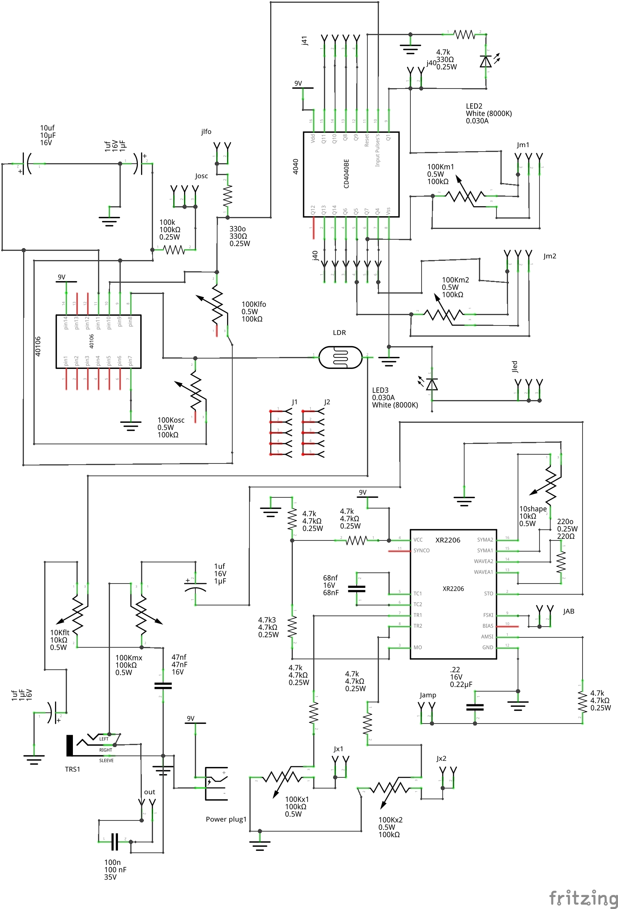
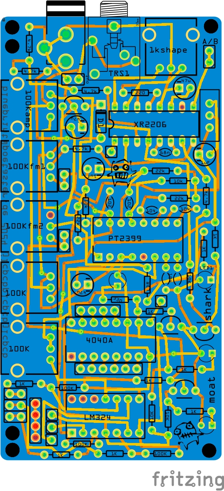

# moat / Keep

A fritzing project to build a semi modular pocket synth. An analog companion to Bastl instruments Kastle. 
Find Kastle source here: https://github.com/bastl-instruments/kastle 

Moat, unlike Kastle, is analog. It uses a Hex Schmitt-trigger (40106be) for pulses (lfo/osc), a binary ripple counter (4040) for sequencing and an XR 2206 for FM and AM audio. And (very) primitive filters. It sequences using the binary ripple counter, mashed :) Now this actually refers to keep, and Moat has been reborn. See below.

The XR features 2 FM inputs and one AM input. The waveshape of the XR can be tuned from brash triangle to simple sine. The XOR is providing on LFO pulse and one square wave OSC. And everything modulates:)

Some audio samples can be found here: https://poetaster.org/keep . You can also order a kit to make it from me :) I also sell on https://tonetoys.etsy.com and Tindie.

It's a self-sequencing, semi-modular, pocket synth. Props to minimo, bastl, minty synth etc!

## keep, Version 4 is now in production. 

''Don't use the old moat fritzing projects''.

Version 4 adds waveshaping on the amplitude modulation input, changes the order of the sequencer mix and adds outputs on the rest of the 4040 Q outputs. Otherwise, it adds more space, especially to ease installing vactrol

## Moat

I had retired the name as I was thinking of a variant and different behaviour and the old moat became keep. Now, we finally have a moat! A production test run is on order:

And, the next variant, with a digital delay component, the moat shark (full name, moat shark, lazer arcade):

## Historical builds

Sadly, no pics of the ones in mint tins. Yes, I did that :)

