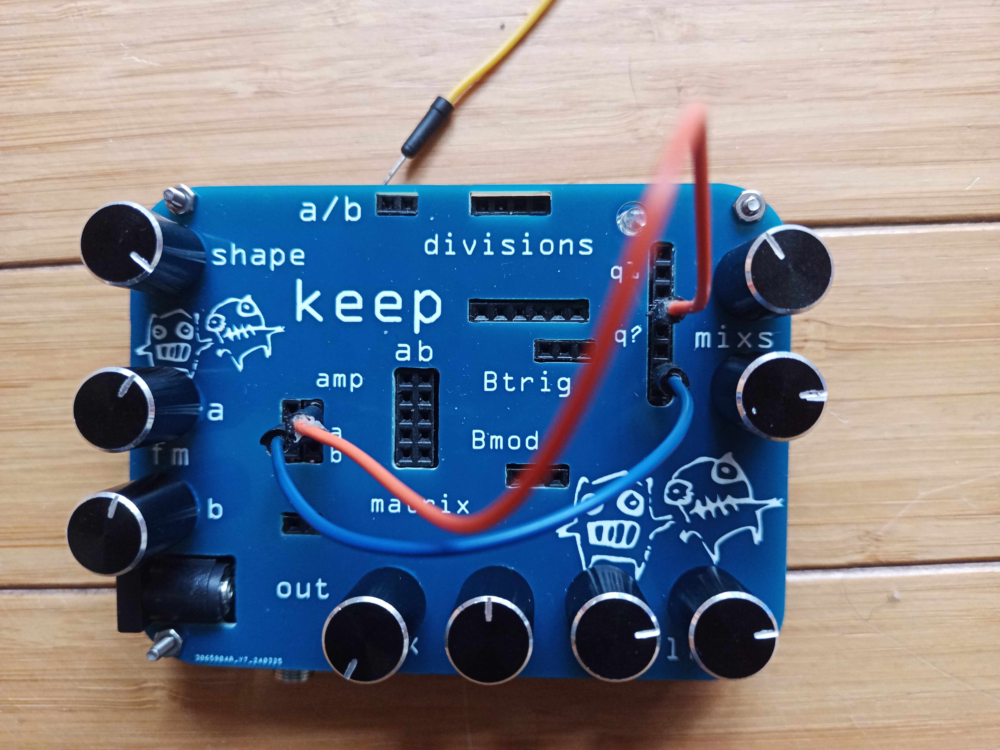
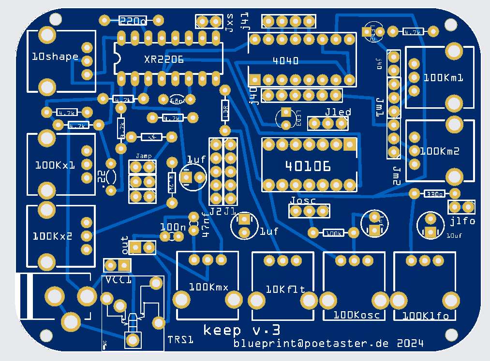
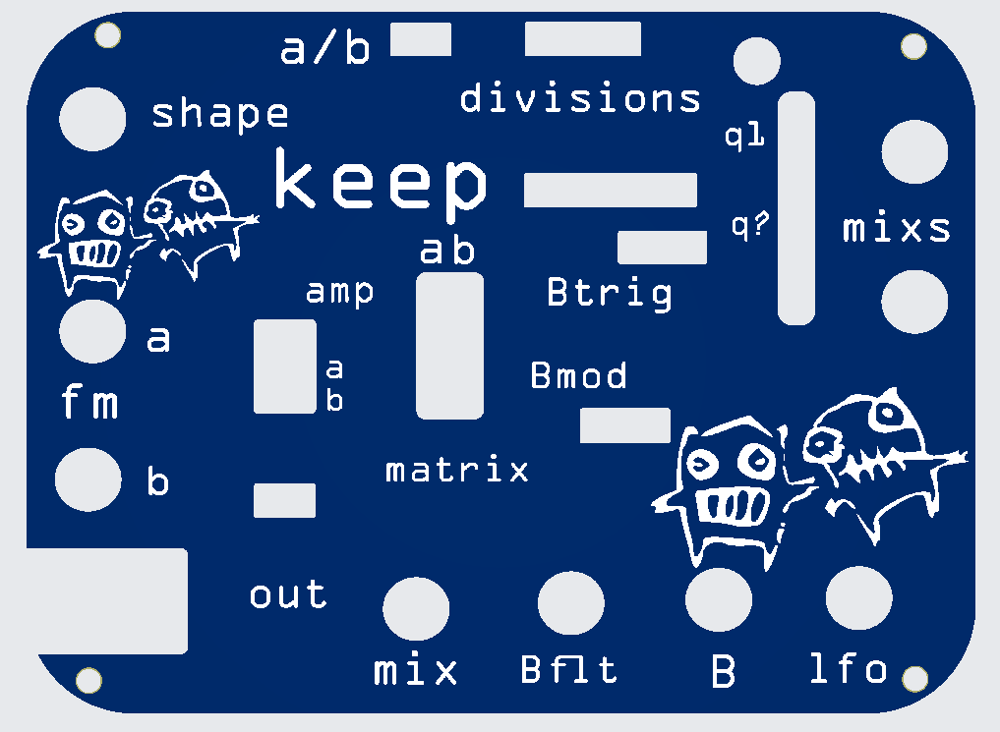
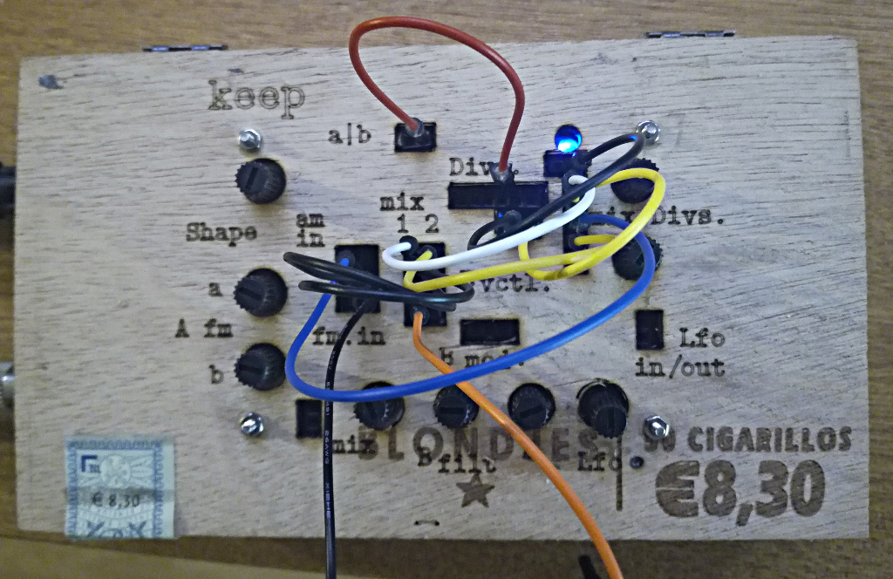
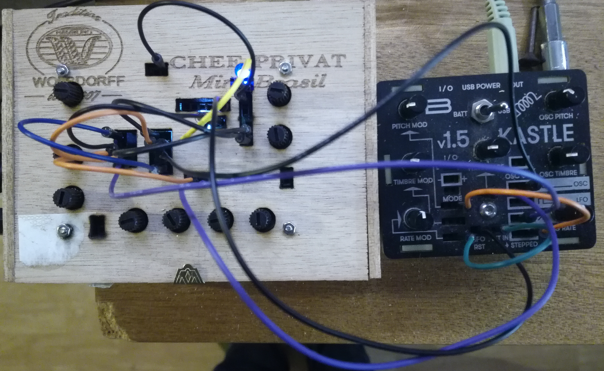

# moat / Keep

A fritzing project to build a semi modular pocket synth. An analog companion to Bastl instruments Kastle. 
Find Kastle source here: https://github.com/bastl-instruments/kastle 

Moat, unlike Kastle, is analog. It uses simple switching (pulse waves), a frequency divider and an XR 2206. And primitive filters. It sequences using the divider :) 

The XR features 2 FM inputs and one AM input. The waveshape of the XR can be tuned from brash triangle to simple sine. The XOR is providing on LFO pulse and one square wave OSC. And everything modulates:)

Some audio samples can be found here: https://poetaster.org/keep . You can also order a kit to make it from me :)

It's a self-sequencing, semi-modular, pocket synth. Props to minimo, bastl, minty synth etc!

## keep, Version 4 is now in production. 

''Don't use the old moat fritzing projects''.

Version 4 adds waveshaping on the amplitude modulation input, changes the order of the sequencer mix and adds outputs on the rest of the 4040 Q outputs. Otherwise, it adds more space, especially to ease installing vactrol

## Historical builds

Sadly, no pics of the ones in mint tins. Yes, I did that :)

