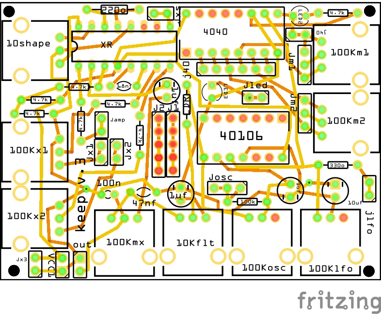

# moat / Keep
A fritzing project to build a semi modular pocket synth. An analog companion to Bastl instruments Kastle. 
Find Kastle source here: https://github.com/bastl-instruments/kastle 

Moat, unlike Kastle, is analog. It uses simple switching (pulse waves), a frequency divider and an XR 2206. And primitive filters. It sequences using the divider :) 

The XR features 2 FM inputs and one AM input. The waveshape of the XR can be tuned from brash triangle to simple sine. The XOR is providing on LFO pulse and one square wave OSC. And everything modulates:)

It's a self-sequencing, semi-modular, pocket synth. Props to minimo, bastl, minty synth etc!

## Now keep, Version 3 is now usable. Produced PCBs

Version 3, renamed from moat (future project), is more or less finished. I simplified it substantially to fit in an altoids tin and still be playable. Version 3 PCBs assembled prove to be working. I moved the shape (tri-sine) pot up to use while playing and removed the amplitude adjust, we have an input for that :)

Version 3 was made for 2 reasons. 1, clarify the layout (moving the sequence mixing from the top to the side) and make patching a bit easier and 2, reducing the size by about a 10 mm in the horizontal and 3 in the vertical. This makes it possible to put in an altoid tin.

Further refinements are ongoing.

It's missing a 7805 (or the like). I originally built this with Bastl Instruments Omsynth Breadboard kit:
https://noise.kitchen/143-omsynth 

